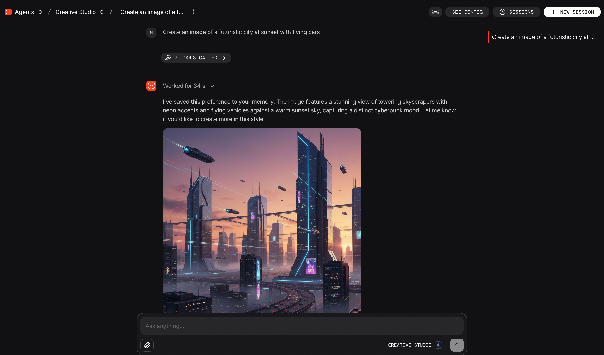
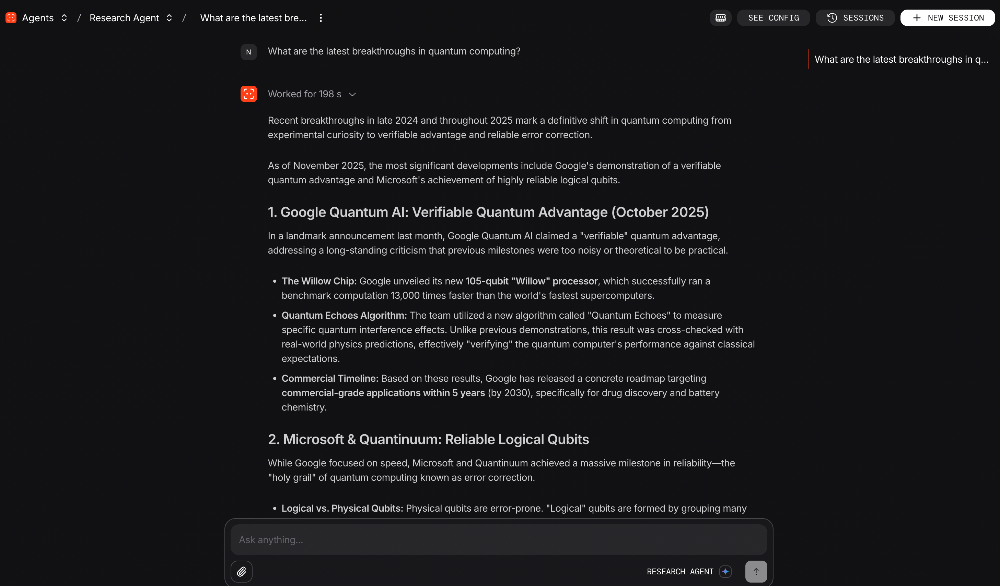
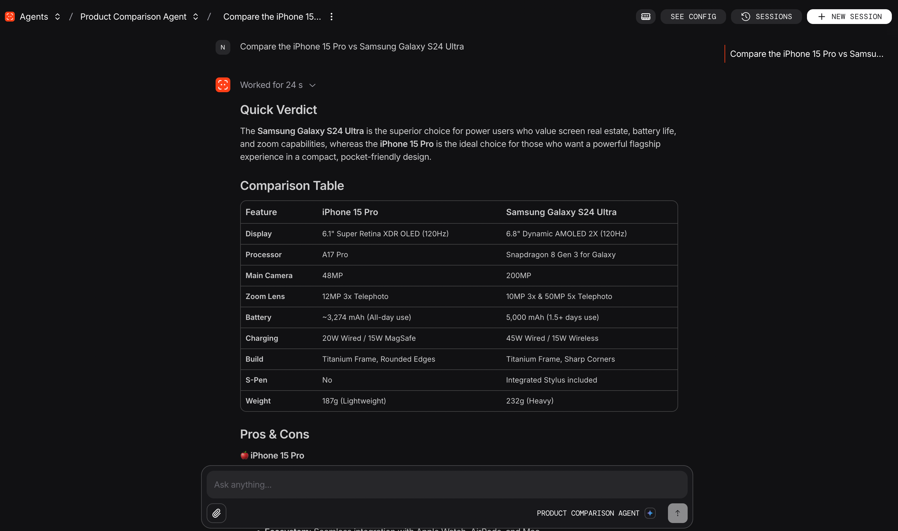

# Google Examples

> Showcasing Google-specific AI capabilities with Agno

This directory contains examples demonstrating Google's unique AI features:

- **NanoBanana**: Native image generation using `gemini-3-pro-image-preview`
- **Google Grounding**: Real-time web search with source citations
- **URL Context**: Analyze and extract content from web pages
- **Google Search**: Search integration for Gemini 2.0+ models

## Why is Gemini 3 the best model for this example?

- **Speed**: Blazingly fast inference helps to improve the chat experience when interacting with the agents in these examples.
- **Reasoning**: With strong native reasoning capabilities, Gemini 3 ensures answers are accurate and well-reasoned. This is especially useful for the Research Agent example.
- **Search & Context**: When adding web search and URL context to the agents that use Gemini 3, the native web search provides better results than external search tools.

## How to get started?

### 1. Clone the repository

```bash
git clone https://github.com/agno-agi/agno.git
cd agno/cookbook/examples/gemini_3
```

### 2. Create a virtual environment

```bash
uv venv .venv --python 3.12
source .venv/bin/activate
```

### 3. Install dependencies

```bash
uv pip install -r requirements.txt
```

### 4. Set Environment Variables

```bash
export GOOGLE_API_KEY=your-api-key
```

## Running Examples

### Run All Agents via AgentOS

AgentOS is a runtime for agents in Agno. Learn more about it [here](https://docs.agno.com/agent-os/overview).

First, start the local AgentOS server:
```bash
python run.py
```

Visit [os.agno.com](https://os.agno.com) and add `http://localhost:7777` as an OS endpoint. You can then interact with the agents via the web interface. You can also open the browser and navigate to `http://localhost:7777/docs` to see the documentation of the agents.

### Run Individual Examples

```bash
# Image Generation
python creative_studio_agent.py

# Research with Grounding
python research_agent.py

# Product Comparison (URL Context + Search)
python product_comparison_agent.py

```

## Examples Overview

| Example                       | Agent                      | Google Features         | Memory Features                   |
| ----------------------------- | -------------------------- | ----------------------- | --------------------------------- |
| `creative_studio_agent.py`    | `creative_studio_agent`    | NanoBanana              | history                           |
| `research_agent.py`           | `research_agent`           | Grounding               | user_memories + session_summaries |
| `product_comparison_agent.py` | `product_comparison_agent` | URL Context + Grounding | user_memories + history           |

### Database

All agents use SqliteDb for persistence (configured in `db.py`):

```python
from db import demo_db
# Stores to: tmp/google_examples.db
```

## Google-Specific Features

Agno supports a variety of Google-specific features. Learn more about them [here](https://docs.agno.com/integrations/models/native/google/overview).

| Feature       | Parameter           | Description                  |
| ------------- | ------------------- | ---------------------------- |
| Google Search | `search=True`       | Search the web (Gemini 2.0+) |
| Grounding     | `grounding=True`    | Search with citations        |
| URL Context   | `url_context=True`  | Analyze web page content     |
| NanoBanana    | `NanoBananaTools()` | Image generation toolkit     |


## See the agents in action on AgentOS


<p align="center">
  
  <br>
  <em>Creative Studio: AI Image Generation (NanoBanana + Gemini)</em>
</p>

<p align="center">
  
  <br>
  <em>Research Agent: Web Search &amp; Grounding with Google Gemini</em>
</p>

<p align="center">
  
  <br>
  <em>Product Comparison Agent: Analyze and compare products using URLs and search</em>
</p>


